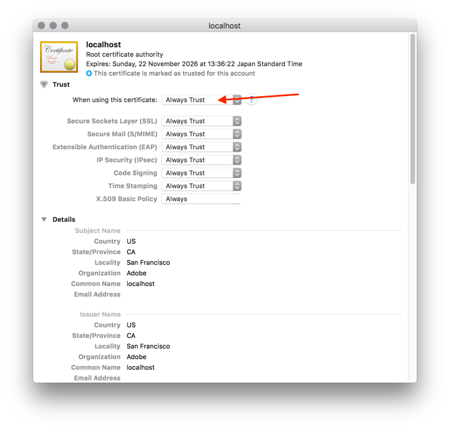
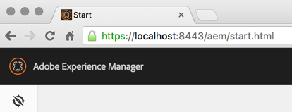

Enable SSL in AEM with _trusted_ self signed certificate
========================================================
The idea is to create our own root ca and then a certificate for it. Afterwards, we trust our
own root ca system wide, so all other apps with trust our cert.

In this example we use 'localhost' as CN for the certificate. this works on OSX, but I didn't
on windows. If you control any DNS, you can also add a A record `localhost.mydomain.com -> 127.0.0.1` to it,
and use this as CN. Then it also worked on windows after installing the root CA.


1. Create root key

```
openssl genrsa -out rootCA.key 2048
```

2. Create root cert:

```
$ openssl req -x509 -new -nodes -key rootCA.key -sha256 -days 3650 -out rootCA.pem
...
Country Name (2 letter code) [AU]:US
State or Province Name (full name) [Some-State]:CA
Locality Name (eg, city) []:San Francisco
Organization Name (eg, company) [Internet Widgits Pty Ltd]:Company
Organizational Unit Name (eg, section) []:
Common Name (e.g. server FQDN or YOUR name) []:My Super Cool Root CA
```

3.Create key and keystore

```
keytool -genkeypair -keyalg RSA -validity 3650 -alias localhost \
    -keystore keystore.jks -keypass password -storepass password \
    -dname "CN=localhost.mydomain.com, O=Company, L=San Francisco, S=CA, C=US"
```

4. Create csr

```
keytool -certreq -alias localhost -file localhost.csr -keystore keystore.jks -storepass password
```

5. Sign csr

```
openssl x509 -req -in localhost.csr -CA rootCA.pem -CAkey rootCA.key -CAcreateserial -out localhost.crt -days 3650 -sha256
```

6. Import root CA

```
keytool -importcert -trustcacerts -file rootCA.pem -alias root -keystore keystore.jks -storepass password
```

7. Import localhost cert

```
keytool -importcert -trustcacerts -file localhost.crt -alias localhost -keystore keystore.jks -storepass password
```

8. Import root ca in osx keychain:



9. Update OSGi config

see: https://docs.adobe.com/docs/en/aem/6-2/deploy/configuring/config-ssl.html#Enable SSL on the Author Instance

or execute `install-config.sh` script.

10: Connect to test:

https://localhost:8443/


